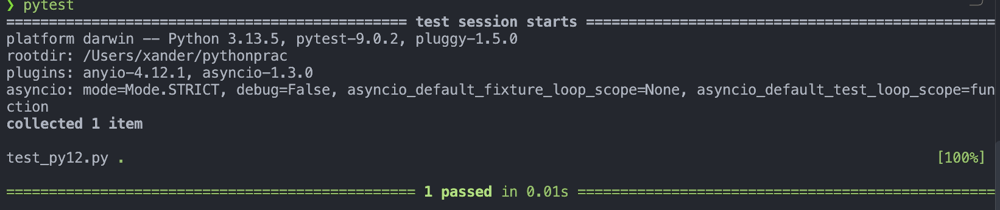
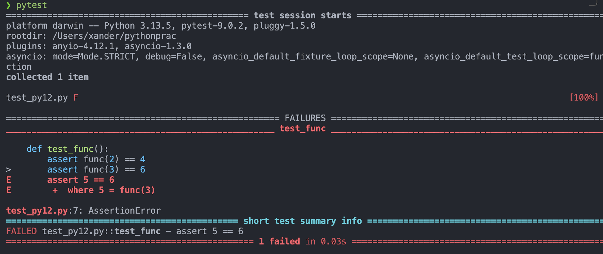
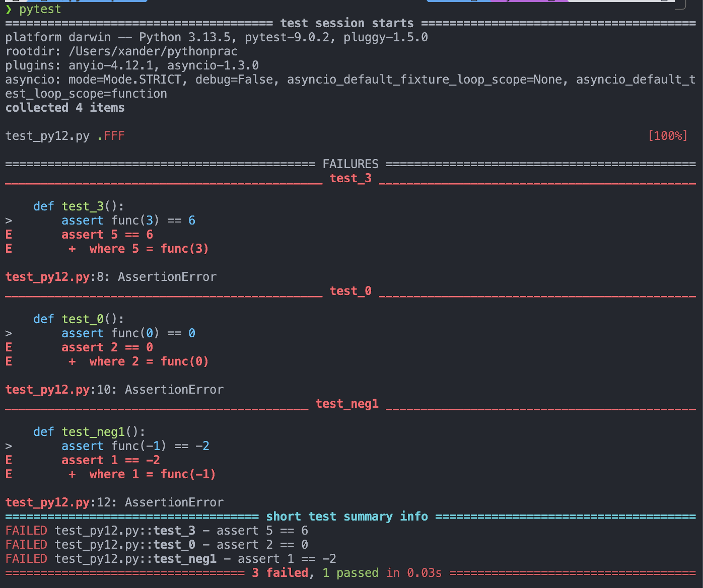

# Pytest入门


pytest是一个第三方库，可以帮助我们更加快且简便的测试函数，不需要写大量的if, exception等语句


pytest官方文档: https://docs.pytest.org/en/stable/getting-started.html

cs50课程：https://youtu.be/tIrcxwLqzjQ?si=RQmnC7unop4EOEuD

### 关键词：assert

例如：

```
assert 1 + 1 == 2
```

意思是：

> 我断言这个条件一定是真的。

如果条件：

```
1 + 1 == 2
```

是：

```
True
```

程序继续执行。

如果：

```
assert 1 + 1 == 3
```

条件是 `False`，就会：

```
AssertionError
```

所以：

```
assert func(2) == 4
```

就是：

> 我认为 `func(2)` 的正确结果应该是 `4`，pytest 帮我验证一下。

这其实是 pytest 最基础、最重要的思想。


#### 如何使用pytest?

首先安装pytest:

```bash
pip install -U pytest
```

检查一下是否安装好了：

```bash
pytest --version
```

创建一个主文件：

```python
def main():
    y = func(int(input("Enter a number: ")))
    print(y)

def func(x):
    return x * 2

if __name__ == "__main__":
    main()
```


测试用的文件：

```python
from py12 import func
def main():
    test_func(int(input("Enter a number: ")))

def test_func():
    assert func(2) == 4
    assert func(3) == 6
    assert func(0) == 0
    assert func(-1) == -2
```

直接终端输入pytest, pytest会run all files of the form `test_*.py` or `*_test.py` in the current directory and its subdirectories

输出



如果我们改一下函数：

```python
def func(x):
    return x + 2
```

再次运行pytest

那么结果将会是：



这里从第二个语句开始就报错了，抛出==AssertionError==

一个测试函数中，只要某个 `assert` 失败，这个测试函数就会立刻停止执行，后面的 assert 不会继续执行。

这样有个问题是如果我们想要知道到底有哪些语句报错了的话，我们这样写是没有办法知道的，所以我们可以改一下测试文件，我们分类一下测试的函数

```python
from py12 import func
def main():
    test_func(int(input("Enter a number: ")))

def test_2():
    assert func(2) == 4
def test_3():
    assert func(3) == 6
def test_0():
    assert func(0) == 0
def test_neg1():
    assert func(-1) == -2
```



这样我们就看到了所有情况的测试结果

